# AI Gateway Web

AI Gateway Web 为 AI 网关的用户提供图形化操作界面，用于管理与查看 AI 网关的主要配置。

## 适用环境（必读）

**本文档的配置步骤、示例命名（如集群/实例池名称）以及截图，基于 [ai-gateway-demo](https://github.com/yf-networks/ai-gateway-demo) 提供的 K8S 演示环境整理。**

如使用自建环境/生产环境（域名、端口、Service 名称、网络策略等不同），界面字段与配置值请以实际部署为准。

**从源代码构建**：
- 请参见：[`BUILD_GUIDE.md`](BUILD_GUIDE.md)

## 目录

- [资源管理](#资源管理)
	- [AI 网关资源](#ai-网关资源)
	- [大模型资源](#大模型资源)
- [路由管理](#路由管理)
- [消费者管理](#消费者管理)
- [用户管理](#用户管理)

---

## 资源管理

### AI 网关资源

AI 网关自身可以实现集群化部署，具备多活实例能力，可根据负载动态扩缩容。

配置过程如下：

1. 域名：对外暴露的可访问域名；
2. AI 网关资源池：设置 AI 网关自身属性（hostname、IP 地址或域名、服务端口等），配置多个 AI 网关构成资源池；
3. AI 网关集群：设置集群特性。

#### 域名

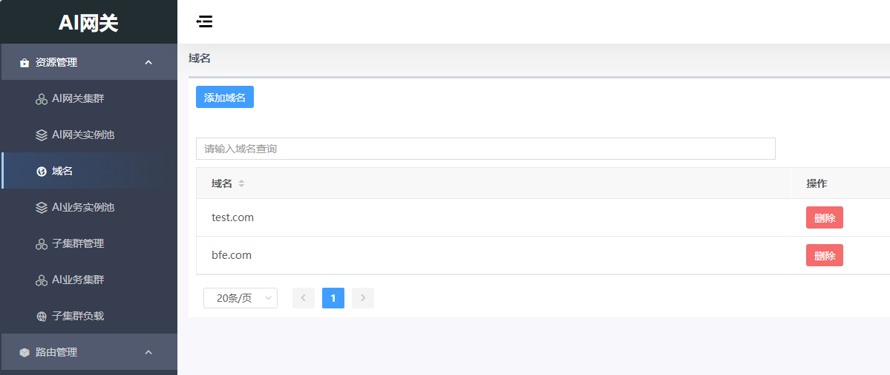

#### AI 网关资源池

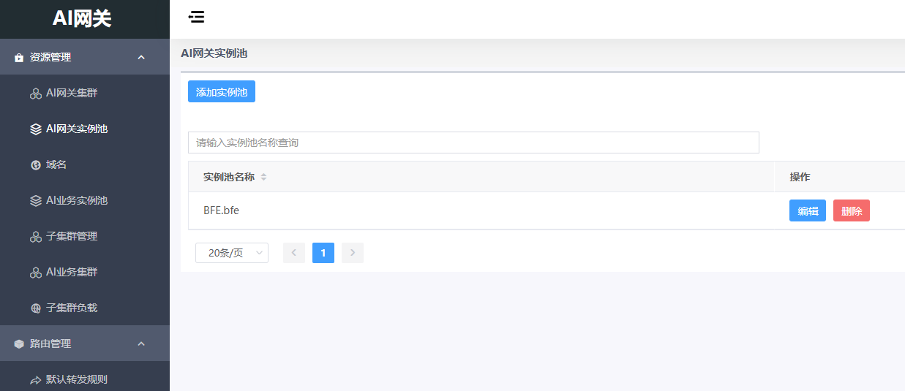

名称可以自定义，IP 地址填写 K8S 集群 IP 地址，端口号示例为 `30080`：

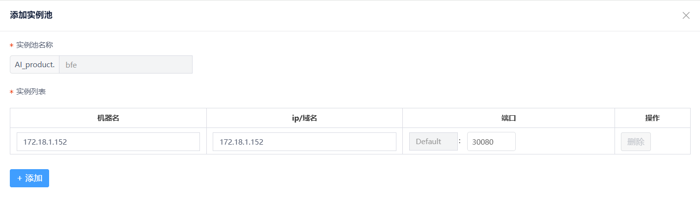

#### AI 网关集群

集群名称示例为 `BFE-AI_product.szyf`，BFE 实例池选择已创建的 BFE 实例池名称：

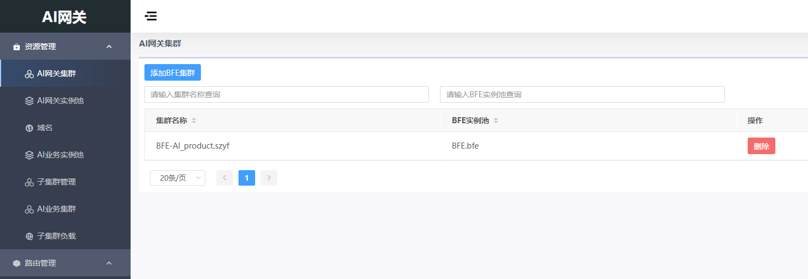

### 大模型资源

AI 网关支持本地私有化部署的大模型实例以及公有云提供的大模型服务，在 K8S 环境中可自动发现大模型服务实例。

配置过程如下：

1. AI 业务实例池：提供大模型服务的实例，配置多个实例构成实例池；
2. 子集群管理：AI 业务实例池构成业务子集群；
3. AI 业务集群：配置集群属性、加载子集群、配置大模型特性；
4. 子集群负载（可选）：配置子集群内 AI 业务实例池的调度特性。

#### AI 业务实例池

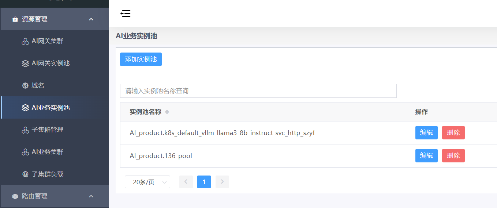

其中 `AI_product.k8s_default_vllm-llama3-8b-instruct-svc_http_szyf` 是由 service-controller 发现并添加的 llm-d 推理模拟器演示后端服务。该实例池会自动更新，通常无需手工修改。

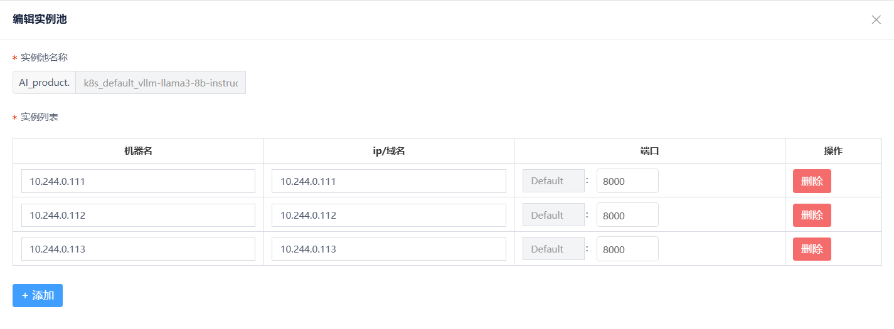

#### 子集群管理

添加子集群并关联到实例池 `AI_product.k8s_default_vllm-llama3-8b-instruct-svc_http_szyf`：

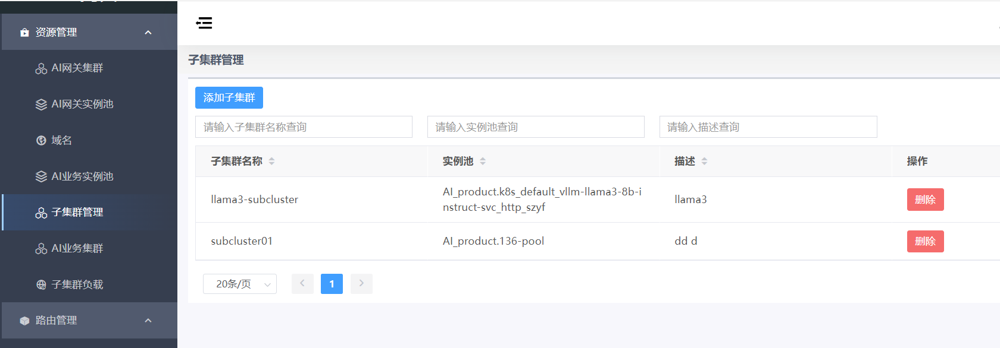

#### AI 业务集群

添加 AI 业务集群挂载 llm-d 推理模拟器演示子集群：

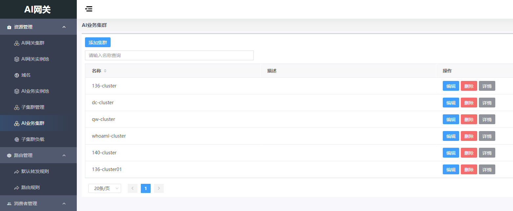

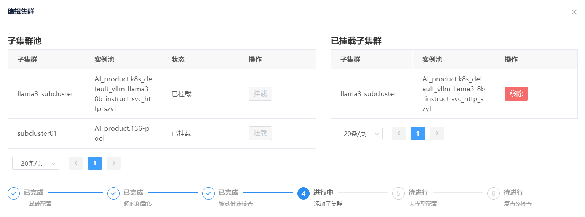

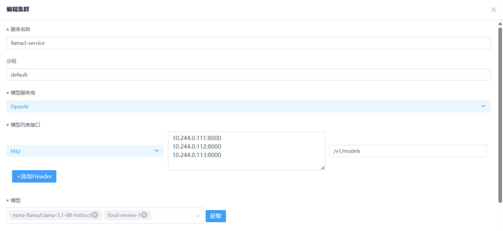

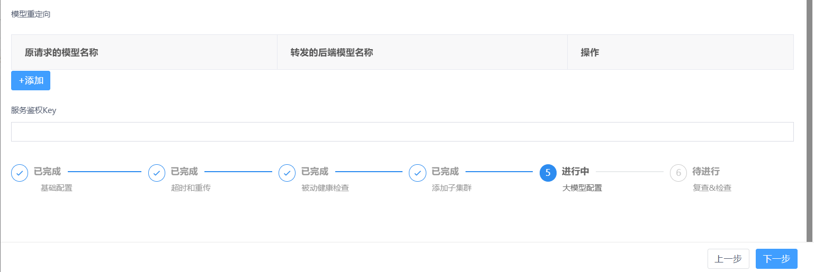

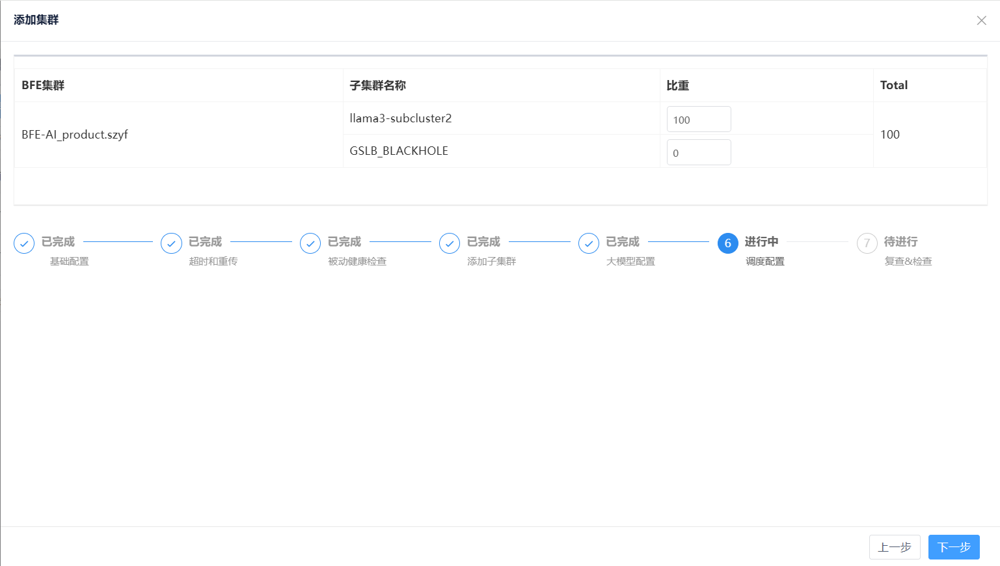

#### 子集群负载（可选）

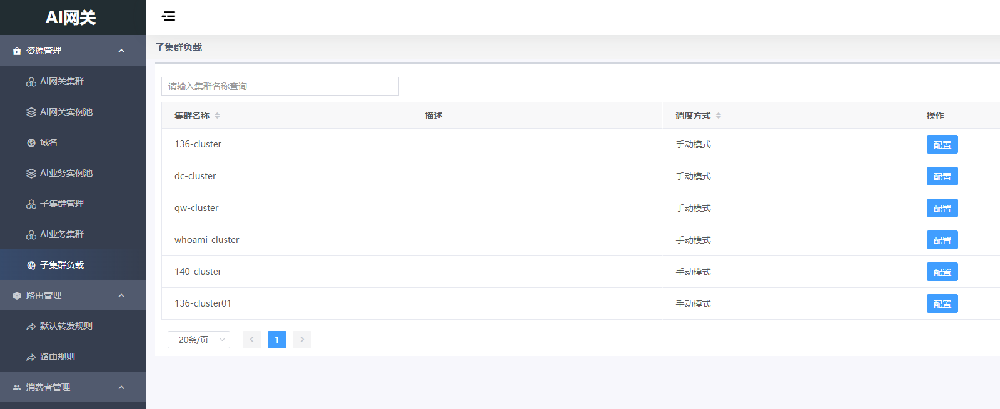

---

## 路由管理

### 路由规则

支持多维度的流量路由策略，包括：

- 基于 URL 的转发
- 基于请求路径（Path）和 HTTP Header 字段的转发，支持精确匹配、前缀匹配、后缀匹配等多种匹配模式
- 基于模型名称（model name）的智能路由，实现请求精准分发至对应后端模型服务

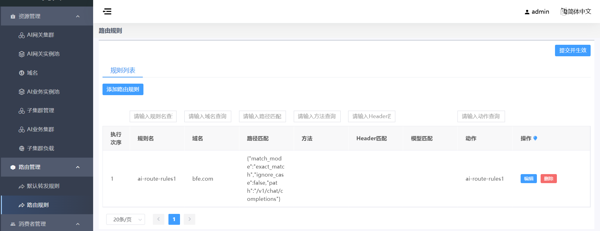

示例：匹配路径设置为 `/v1/chat/completions`，目标集群选择 llm-d 推理模拟器演示集群。


### 默认转发规则

支持默认兜底的转发规则设置。

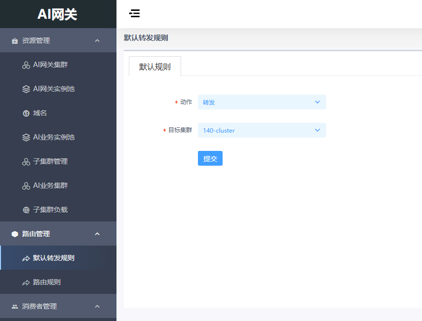

---

## 消费者管理

### API Key 管理

提供面向消费者的完整 API Key 生命周期管理能力，包括 API Key 的生成、授权使用、鉴权验证、吊销等关键操作，确保安全可控的访问机制。

基于 API Key 精细化配置使用权限，支持以下策略：

- 指定可调用的大模型列表
- 设置 Token 用量配额
- 配置 API Key 有效期限
- 定义客户端 IP 地址白名单，限制访问来源

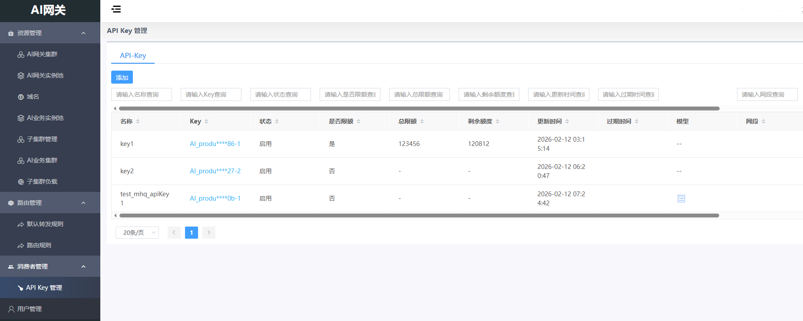

为测试模拟器建立 API Key：

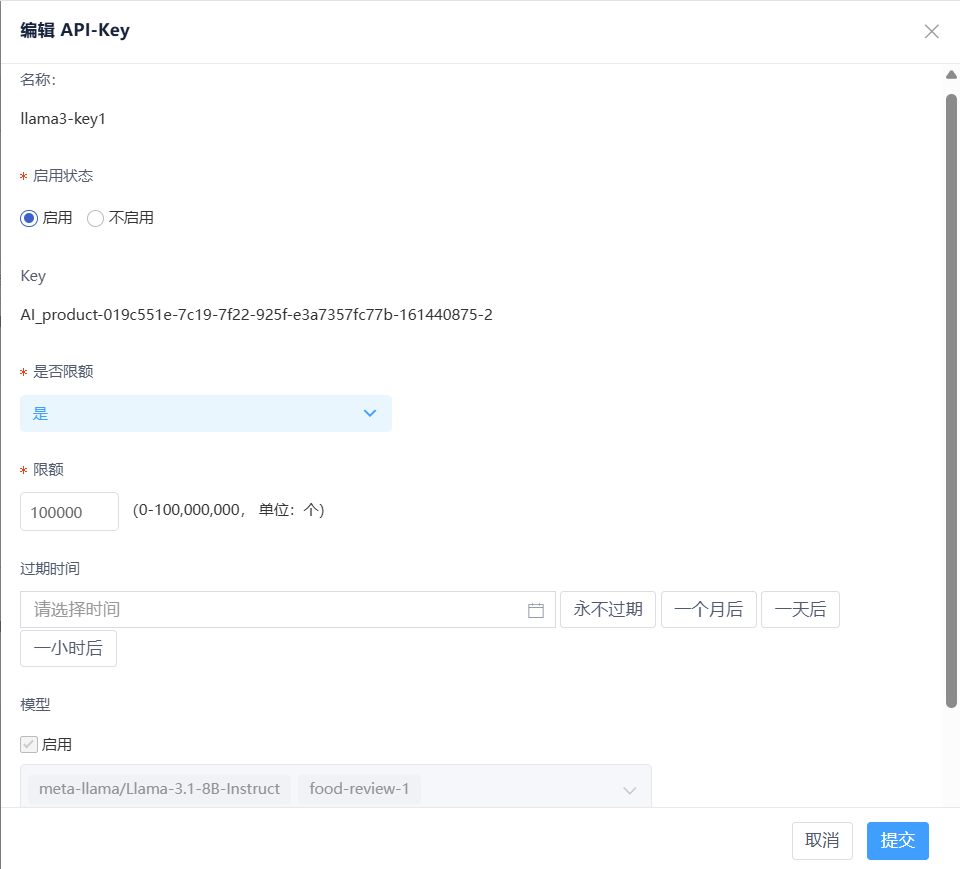

发送请求到 BFE 验证结果（示例命令；请替换 `Host`、网关地址、以及 `Authorization` 中的 API Key）：

```bash
curl -v \
	-H "Host: test.com" \
	-H "Content-Type: application/json" \
	-H "Accept: text/event-stream" \
	-H "Authorization: AI_product-019c551e-7c19-7f22-925f-e3a7357fc77b-161440875-2" \
	-X POST \
	-d '{"model":"meta-llama/Llama-3.1-8B-Instruct", "messages":[{"role":"user", "content":"测试"}]}' \
	http://172.18.1.152:30080/v1/chat/completions
```

---

## 用户管理

### 控制面用户管理

允许使用控制面的用户配置与管理。

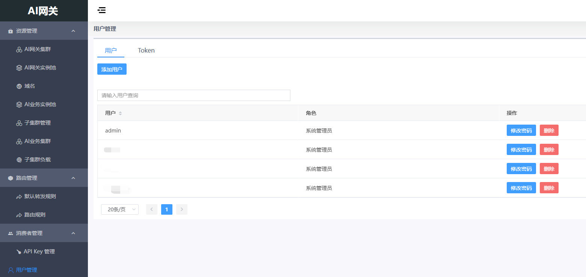

### Token 管理

内部模块访问鉴权的配置管理，一般不需要修改。

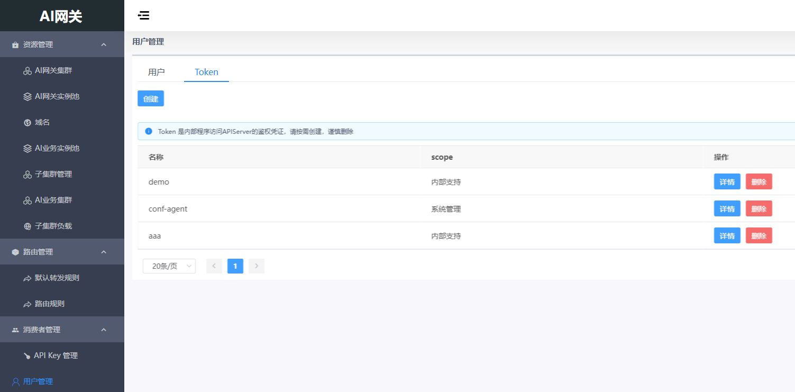

---

## 参考资料

- 演示环境（K8S）：[ai-gateway-demo](https://github.com/yf-networks/ai-gateway-demo)
- AI Gateway API：[ai-gateway-api](https://github.com/yf-networks/ai-gateway-api)
- 部署指南：[docs/zh-cn/deploy.md](docs/zh-cn/deploy.md)
- 开发指南：[docs/zh-cn/develop.md](docs/zh-cn/develop.md)

## 社区贡献

请参考：[CONTRIBUTING.md](CONTRIBUTING.md)

## License

请参考：[LICENSE](LICENSE)
