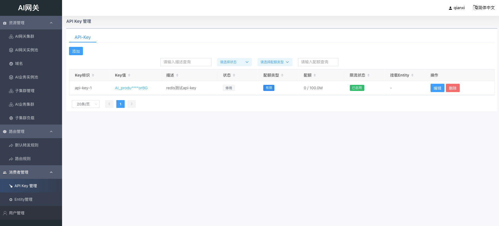
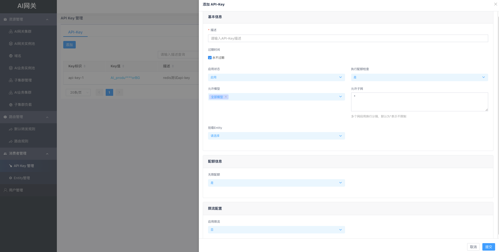

# API Key 管理

## 概述

API Key是访问AI网关API服务的身份凭证。通过API Key可以控制调用身份、模型访问范围、IP网段、Token配额与请求速率。

API Key可选挂载到一个Entity，挂载后将同时受Entity及其祖先链上的模型访问控制、限流与配额策略约束。

## API Key 列表

在左侧菜单进入「消费者管理」→「API Key管理」，可查看所有API Key。

列表展示以下信息：

- **Key标识**：API Key的内部唯一ID
- **Key值**：用于请求鉴权的密钥（列表中部分脱敏，点击可查看完整值并复制）
- **描述**：API Key的描述信息
- **状态**：启用或停用
- **配额类型**：无限或有限（取决于「执行配额检查」配置）
- **配额**：有限配额时显示「已用 / 总量」
- **限流状态**：是否已启用限流策略
- **挂载Entity**：关联的Entity名称，未挂载时显示「-」

列表支持按描述、状态等字段搜索和排序。点击表格行可进入详情查看模式；操作列提供「编辑」和「删除」。

## 创建 API Key

点击「创建」按钮，在右侧抽屉中填写配置项，完成后点击「提交」。

### 基本信息

- **描述**：必填，最大1024字符，用于标识该Key的用途
- **过期时间**：
  - 勾选「永不过期」：Key永久有效
  - 不勾选：需选择过期日期（必须在当前日期之后）
- **启用状态**：启用或停用该API Key
- **执行配额检查**：
  - 「是」：网关对该Key执行配额控制
  - 「否」：跳过Key级别的配额检查（默认「是」）
- **允许模型**：多选允许访问的模型，或选择「全部模型（*）」表示不限制
- **允许子网**：允许访问的客户端IP网段，CIDR格式，每行一个；默认`*`表示不限制
- **挂载Entity**：可选，选择该Key所属的组织Entity

### 配额信息

当「无限配额」设为「否」时，需配置以下参数：

- **无限配额**：
  - 「是」：不限制Token用量
  - 「否」：需配置配额参数
- **配额不足时放行**：
  - 「是」：余额不足时仍放行请求
  - 「否」：余额不足时拒绝请求
- **配额总量**：Token配额总量，需要大于等于0
- **配额单位**：目前仅支持`total_token`
- **重置周期**：永不重置/每周/每月（基于自然周/自然月）

### 限流配置

- **启用限流**：
  - 「是」：需配置限流规则
  - 「否」：不限制请求速率

启用限流后，TPM规则、RPM规则、最大并发至少需配置一项。

#### TPM规则（Token速率限制）

最多添加3条，每条包含：

- **规则名称**：必填，同一策略内不可重复
- **适用模型**：该规则适用的模型，`*`表示全部模型
- **时间窗口**：统计窗口（分钟），范围1–360
- **最大Token数**：窗口内允许的最大Token数
- **滑动步长**：滑动窗口步长（分钟），范围1–时间窗口

#### RPM规则（请求速率限制）

最多添加3条，每条包含：

- **规则名称**：必填，同一策略内不可重复
- **适用模型**：该规则适用的模型，`*`表示全部模型
- **时间窗口**：统计窗口（分钟），范围1–360
- **最大请求数**：窗口内允许的最大请求数

#### 最大并发数

设置同时处理的最大请求数，**-1**表示不限制。

## 编辑 API Key

在列表操作列点击「编辑」，或在详情页点击「编辑」，修改配置后点击「提交」保存。

注意事项：

- Key值创建后不可修改，仅可在详情页查看和复制
- 若将Key挂载到新的Entity，且Key开启了有限配额，则新Entity或其祖先链上需至少存在一个有效的配额计划

## 查看详情与重置配额

点击列表中的任意一行，进入详情查看模式，可查看基本信息、配额使用进度和限流规则。

对于有限配额的Key，详情页展示：

- 配额总量、已用量、剩余量及使用进度条
- 重置周期

点击「重置配额」可手动重置余额：

- **新的配额总量**：设置重置后的配额上限（最小值为0）
- **重置原因**：可选，用于审计记录

重置后已使用量归零，剩余量等于新设置的配额总量。

## 删除 API Key

在列表操作列点击「删除」，确认后删除该Key。

删除API Key将级联删除其专属的配额计划与限流策略（若不被其他对象引用）。删除可能影响正在处理中的请求，请谨慎操作。
