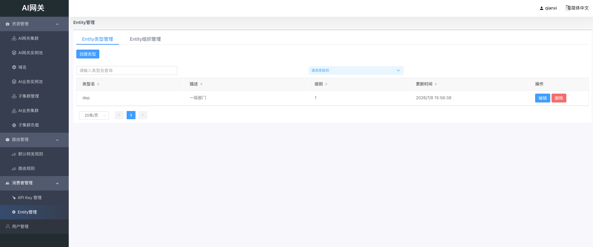
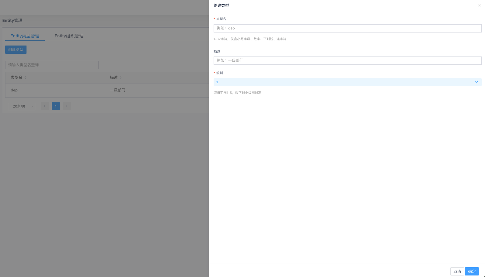
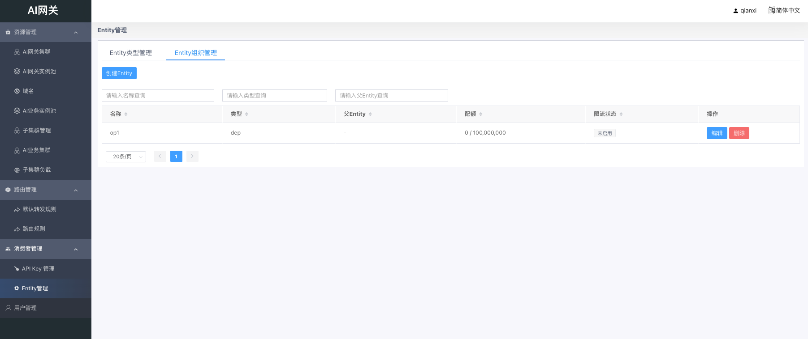
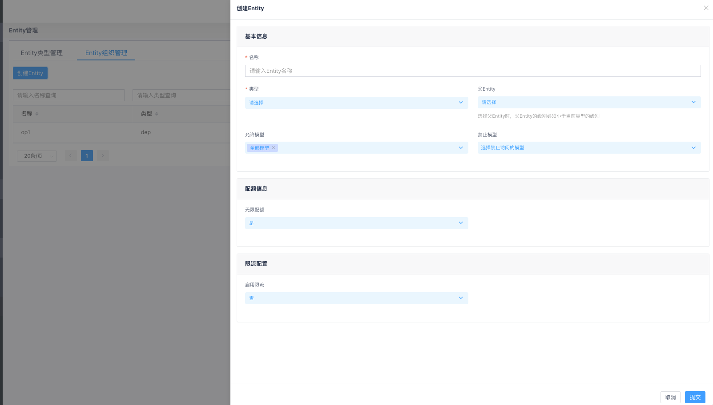

# Entity 管理

## 概述

Entity是用于组织和管理消费者的实体单元，可以是部门、团队、个人等组织单位。通过Entity类型定义层级结构，通过Entity组织树实现层级化的模型访问控制、配额与限流管理。

挂载到Entity的API Key会同时受该Entity及其所有祖先Entity的策略约束。

在左侧菜单进入「消费者管理」→「Entity管理」，页面包含两个标签页：

- **Entity类型管理**：定义Entity的类型与层级
- **Entity组织管理**：创建和管理具体的Entity实例

## Entity类型管理

Entity类型定义了Entity的层级结构。使用前需先创建Entity类型。

### 类型列表

列表展示类型名、描述、级别和创建时间，支持搜索和排序。

### 创建Entity类型

点击「创建类型」，配置以下字段：

- **类型名**：必填，全局唯一，1–32字符，仅含小写字母、数字、下划线、连字符（如`dep`、`team`）；创建后不可修改
- **描述**：类型描述，最大1024字符
- **级别**：取值1–5，数字越小级别越高（如1级为最高层级）

### 编辑与删除

- **编辑**：仅可修改描述，类型名和级别创建后不可更改
- **删除**：若该类型下仍存在Entity，将无法删除

### 层级关系

- 高级别Entity类型可作为低级别Entity的父级
- 例如：级别1的「部门」类型可作为级别2的「团队」类型的父Entity

## Entity组织管理

### Entity列表

列表展示名称、类型、父Entity、配额用量和限流状态，支持搜索和排序。点击表格行进入详情查看模式。

### 创建Entity

点击「创建Entity」，配置以下内容：

#### 基本信息

- **名称**：必填，全局唯一；创建后不可修改
- **类型**：选择Entity所属类型，创建后不可修改
- **父Entity**：可选；父Entity的类型级别必须小于当前类型的级别
- **允许模型**：多选允许访问的模型，或选择「全部模型（*）」
- **禁止模型**：多选禁止访问的模型；若某模型同时出现在允许和禁止列表中，以禁止为准

#### 配额信息

当「无限配额」设为「否」时，需配置以下参数：

- **无限配额**：
  - 「是」：不限制Token用量
  - 「否」：需配置配额参数
- **配额不足时放行**：
  - 「是」：余额不足时仍放行请求
  - 「否」：余额不足时拒绝请求
- **配额总量**：Token配额总量，需要大于等于0
- **配额单位**：目前仅支持`total_token`
- **重置周期**：永不重置/每周/每月（基于自然周/自然月）

#### 限流配置

- **启用限流**：
  - 「是」：需配置限流规则
  - 「否」：不限制请求速率

启用限流后，TPM规则、RPM规则、最大并发至少需配置一项。

##### TPM规则（Token速率限制）

最多添加3条，每条包含：

- **规则名称**：必填，同一策略内不可重复
- **适用模型**：该规则适用的模型，`*`表示全部模型
- **时间窗口**：统计窗口（分钟），范围1–360
- **最大Token数**：窗口内允许的最大Token数
- **滑动步长**：滑动窗口步长（分钟），范围1–时间窗口

##### RPM规则（请求速率限制）

最多添加3条，每条包含：

- **规则名称**：必填，同一策略内不可重复
- **适用模型**：该规则适用的模型，`*`表示全部模型
- **时间窗口**：统计窗口（分钟），范围1–360
- **最大请求数**：窗口内允许的最大请求数

##### 最大并发数

设置同时处理的最大请求数，**-1**表示不限制。

配置完成后点击「提交」保存。

## 编辑Entity

在列表操作列点击「编辑」，修改配置后点击「提交」。Entity名称和类型创建后不可修改；修改父Entity时需满足级别约束。

## 查看详情与重置配额

点击列表中的任意一行，进入详情查看模式，可查看基本信息、配额使用进度和限流规则。

对于有限配额的Entity，详情页展示配额总量、已用量、剩余量、重置周期及使用进度条。

点击「重置配额」可手动重置余额：

- **新的配额总量**：设置重置后的配额上限
- **重置原因**：可选，用于审计记录

重置后已使用量归零，剩余量等于新设置的配额总量。

## 删除Entity

在列表操作列点击「删除」，确认后删除。

以下情况无法删除：

- 该Entity下存在子Entity（有其他Entity的parent_id指向它）
- 该Entity已被任何API Key挂载

删除Entity将级联删除其专属的配额计划与限流策略（若不被其他对象引用）。

## 模型访问控制（运行时）

Entity链上的模型访问控制在网关运行时生效，检查顺序如下：

1. 从挂载Entity开始，向上遍历所有祖先Entity（含自身）
2. 对每个Entity依次检查：
   - **禁止模型**（黑名单优先）：包含`*`或命中请求模型则拒绝
   - **允许模型**（白名单）：不包含`*`且请求模型不在列表中则拒绝
3. 检查链中任一Entity触发拒绝，请求立即被拒绝

API Key自身的「允许模型」配置在Entity检查之前独立生效。
