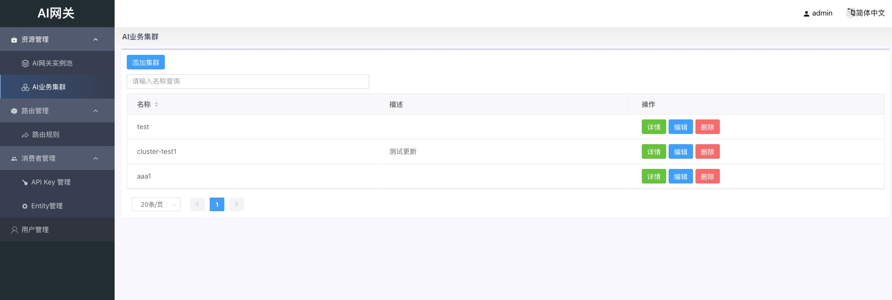
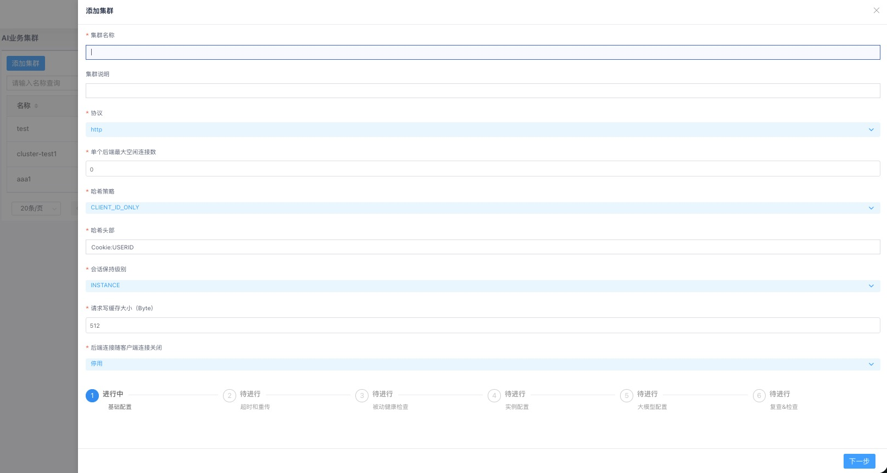
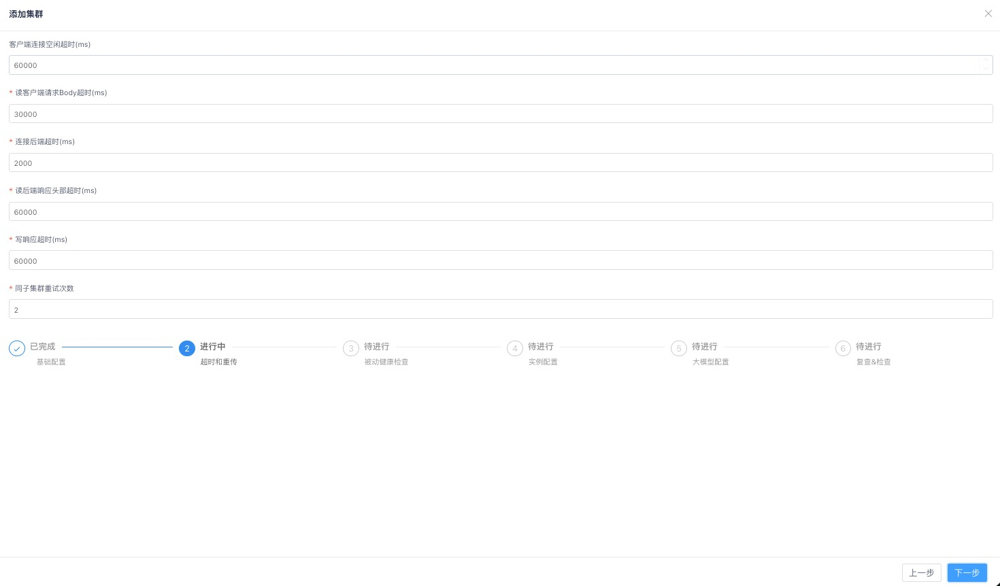
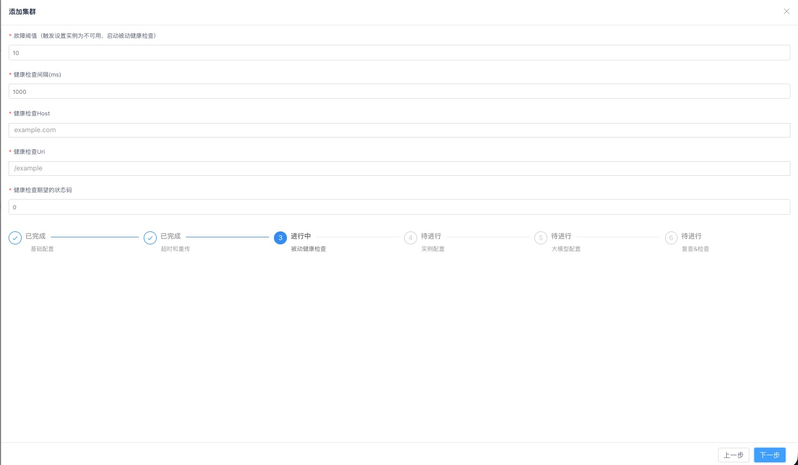
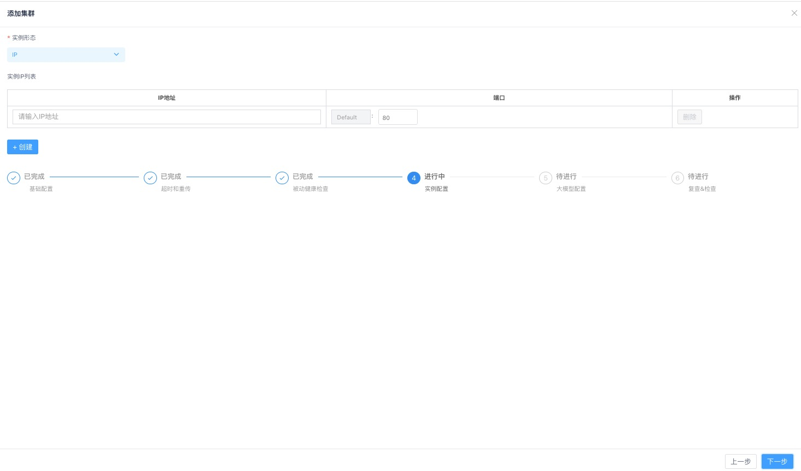
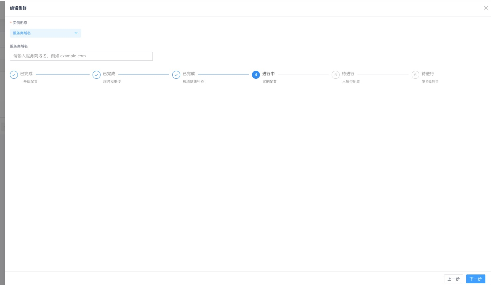

# AI业务集群

## 概述

### 集群

- 具有同类功能的后端的集合定义为一个集群(Cluster)。可定义多个集群。

## AI业务集群

本节说明如何新建一个AI业务集群

- 进入"资源管理"->"AI业务集群"，点击"添加集群"，进入创建集群页面

添加集群步骤较多，下面按顺序说明。

### 设置集群的基础配置

集群的基础配置如下。部分参数详细解释可以参考相关文档。

- **集群名称：** 在产品线内必须唯一
- **单个后端最大空闲连接数** ：AI网关实例与每个后端的最大空闲长连接数。默认值2。
- **哈希策略** ：用于会话保持的请求来源标识的哈希策略。支持如下三种哈希策略：
  - CLIENT_ID_ONLY: 基于特定头部
  - CLIENT_IP_ONLY: 基于请求来源IP
  - CLIENT_ID_PREFERRED: 优先基于特定头部
- **会话保持级别** ：用于会话保持级别的设置
  - 实例级别：相同来源请求，被转发至固定的业务实例
- **请求写缓存大小** ：接收请求时用的缓冲大小，默认值512。
- **后端连接随客户端连接关闭**：
  - 默认值为停用。
  - 设置为启用(true)时，当客户端关闭连接后，AI网关同时关闭到后端实例的连接
  - 设置为停用(false)时，当客户端关闭连接后，AI网关按默认策略决定是否关闭到后端实例的连接

### 设置超时和重传

超时和重传设置包括：

- **客户端连接空闲超时**：对于AI网关和客户端之间建立的HTTP长连接,通信从上一个请求结束，到完成读取下一个请求头部之间的超时设置。单位为ms。
- **读用户请求body超时**：对于AI网关收到的客户端请求，从完成读取请求头部，到完成读取请求主体的超时设置。单位为ms。
- **连接后端超时**：从AI网关向后端业务集群的实例发起建立连接，到建立连接完成的超时设置。单位为ms。
- **读后端响应头部超时**：从AI网关开始向后端业务集群的实例发送请求，到完成接收响应头部的超时设置。单位为ms。
- **写响应超时** ：从AI网关向客户端发送响应头部开始，到将响应完全发送给客户端的超时设置。单位为ms。
- **同子集群重试次数**：请求转发失败后，允许在同一个子集群（或业务实例）内进行重试的最大次数。默认值为2。

### 设置健康检查配置

- **故障阈值**：AI网关对某个后端实例连续转发失败次数超过这个阈值时，将该实例设为不健康，并停止向其转发请求，同时启动健康检查。
- **健康检查间隔** ：启动健康检查后，健康检查请求的时间间隔。
- **健康检查Host**：健康检查请求是一个HTTP请求，此处定义请求的Host字段。
- **健康检查Uri**：健康检查请求是一个HTTP请求，此处定义请求的Request-URI字段(abs_path格式，即绝对路径格式)。
  - 例如：要配置健康检查请求的地址为<http://www.test1.com/interface，则可将Host配置为`www.test1.com`，将Uri配置为`/interface`。>
- **健康检查期望的状态码**：定义期望后端实例返回的http状态码
  - 常见的是200，也允许定义其他返回码
  - 若填写为0时，表示忽略返回码，只要能返回响应即可

### 实例配置

- 业务集群直接配置后端实例，不再通过子集群挂载。
- **实例形态**：支持选择 **IP**（默认）或 **服务商域名**（域名）。
  - 选择 **IP** 时，可添加一个或多个实例，每个实例填写：
    - **IP地址**：后端实例的IP地址。
    - **端口**：后端实例的端口号。
  - 选择 **服务商域名** 时，只需填写一个服务商域名，端口默认使用 443；域名模式下不支持同时填写多个 IP 地址或与 IP 地址混用。

### 大模型配置

大模型配置用于配置业务集群对接的后端大模型服务，相关参数说明如下：

#### 基本信息

- **服务名称**：标识大模型服务的名称，在产品线内必须唯一，最大长度255字节
- **分组**：服务分组名称，最大长度255字节，默认为default

#### 模型服务商

- 选择后端大模型服务提供商，支持：deepseek、openai、qwen等

#### 模型列表接口

- **协议**：http或https
- **地址**：后端大模型服务的地址和端口，例如：172.19.1.187:31801
- **URI**：模型列表接口的路径，例如：/v1/models
- **添加Header**（可选）：如果模型列表接口需要额外的HTTP header，可以在此配置

#### 模型

- 点击**获取**按钮，从模型列表接口获取可用模型
- 从下拉框中选择需要使用的模型，例如：Qwen/Qwen2.5-3B-Instruct

#### 模型重定向

- 可以配置模型名称的映射关系，将请求中的模型名称转换为后端实际使用的模型名称
- **原请求的模型名称**：用户请求中使用的模型名称
- **转发的后端模型名称**：实际转发到后端大模型服务使用的模型名称
- 点击**添加**可以增加模型映射
- 点击**删除**可以移除已有的模型映射

#### 服务鉴权Key

- 用于访问后端大模型服务的鉴权key（可选）
- 如果后端服务需要鉴权，需要在此配置

### 复查&确认

- 对配置的内容进行确认
- 如果没有问题，则点击提交
