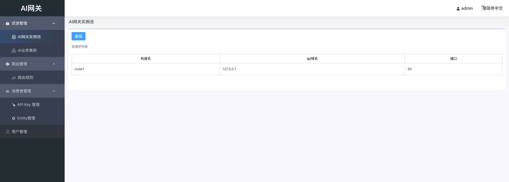
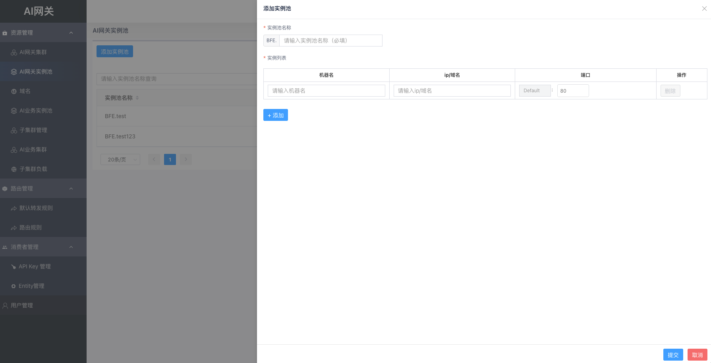
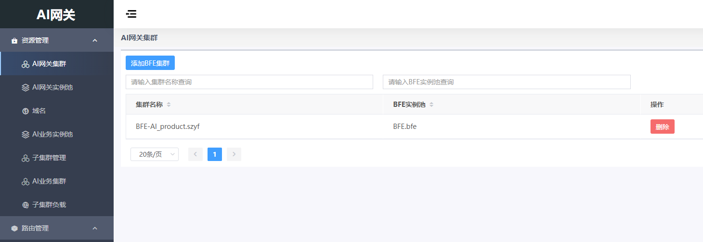
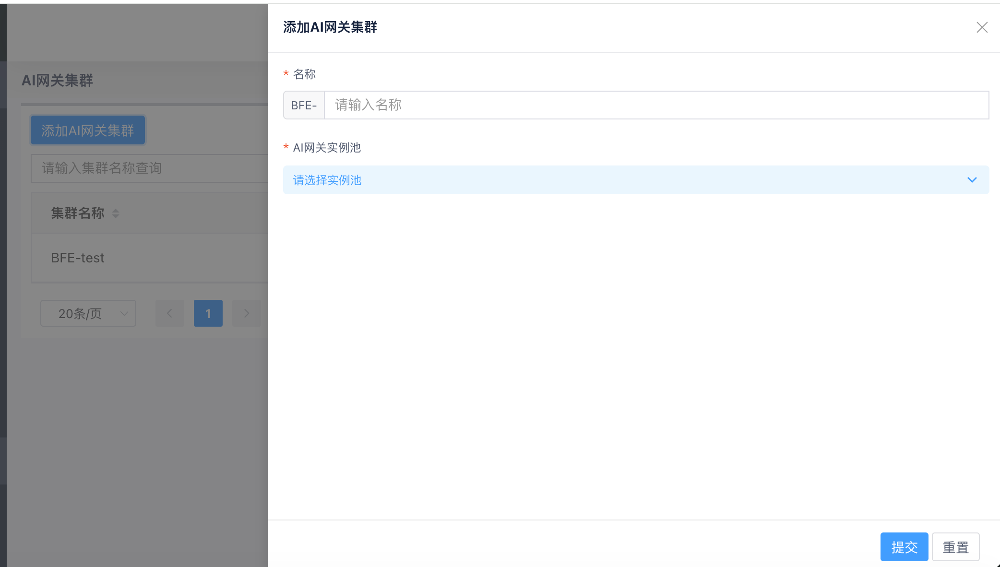

# AI网关集群和实例池

## 概述

- AI网关集群指一组AI网关转发引擎实例组成的集群。
  - 若将AI网关用于多数据中心的流量接入，可将位于同一个数据中心的AI网关转发引擎实例组成一个AI网关集群。

- AI网关实例池由同一个AI网关集群内的所有AI网关转发引擎实例组成。
  - 每个AI网关集群和一个AI网关实例池对应。

在AI Gateway Web上管理AI网关集群，首先要配置AI网关实例池，然后配置AI网关集群。

## AI网关实例池的配置

在AI Gateway Web配置AI网关实例池的操作步骤如下：

- 在左侧菜单，点击"资源管理"->"AI网关实例池"

- 根据实际部署情况，添加AI网关实例池。

- 注意：
  - 实例池名称在新建时设定，后续不可更改；
  - 每个实例池可包含多个实例；
  - 每个实例对应1个IP，1个端口；
- 点击"添加"后完成添加AI网关实例池

## AI网关集群的配置

在AI Gateway Web配置AI网关集群的操作步骤如下：

- 在左侧菜单，点击"资源管理"->"AI网关集群"

- 点击"添加AI网关集群"，输入AI网关集群名称，并选择对应的AI网关实例池

- 点击"提交"后完成添加AI网关集群
