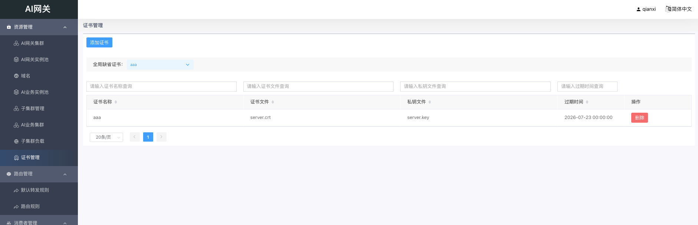
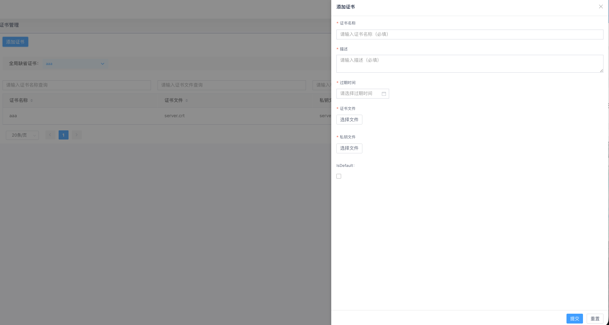

# 证书管理

## 概述

证书管理用于维护 AI 网关 HTTPS 访问所需的 TLS 证书与私钥。管理员可上传证书、查看过期时间，并指定全局缺省证书供未单独配置证书的域名或路由使用。

证书名称在系统内不可重复。

## 证书列表

在左侧菜单，通过「资源管理」→「证书管理」，进入证书管理页面。

列表展示以下信息：

- **证书名称**：证书的唯一标识；鼠标悬停可查看描述信息
- **证书文件**：上传的证书文件名
- **私钥文件**：上传的私钥文件名
- **过期时间**：证书到期时间

列表支持按证书名称、证书文件、私钥文件、过期时间搜索和排序。

页面顶部提供「全局缺省证书」下拉框，用于查看和切换当前默认证书。

## 添加证书

点击「添加证书」按钮，在右侧抽屉中填写配置项，完成后点击「提交」。

### 基本信息

- **证书名称**：必填；不可包含特殊字符（如 `'\"-+=,~`!@#$%^&*();:` 等）
- **描述**：必填
- **过期时间**：必填；选择证书到期日期

### 证书文件

- **证书文件**：必填；点击「选择文件」上传证书文件（如 `.crt`、`.pem`）
- **私钥文件**：必填；点击「选择文件」上传私钥文件

### 默认证书

- **IsDefault**：勾选后，创建时将同时把该证书设为全局缺省证书

点击「重置」可清空表单内容。

## 设置全局缺省证书

在列表页顶部的「全局缺省证书」下拉框中选择目标证书，系统会弹出确认提示。确认后将该证书设为全局缺省证书。

取消操作将恢复为变更前的默认证书。

## 删除证书

在列表操作列点击「删除」，确认后即可删除对应证书。删除后不可恢复，请谨慎操作。
