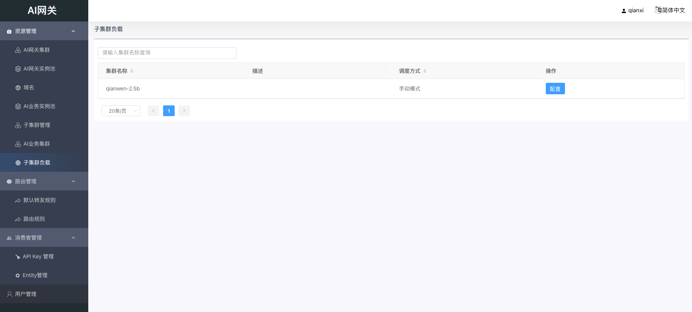
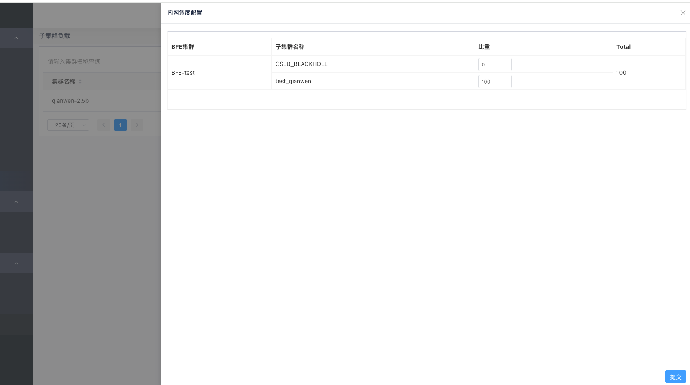

# 子集群负载

## 概述

子集群负载用于配置 AI 业务集群中不同子集群之间的流量分配比例。通过调整权重，可以实现跨数据中心的流量调度和负载均衡。

## 功能说明

在子集群负载页面，您可以：

- 查看所有 AI 业务集群列表
- 为每个集群配置子集群之间的流量分配比例
- 实时检查权重总和是否为 100

## 配置步骤

### 1. 进入子集群负载页面

在左侧菜单中，点击「资源管理」→「子集群负载」。

### 2. 选择要配置的集群

在集群列表中，找到需要配置的业务集群，点击右侧的「配置」按钮。

### 3. 配置子集群权重

在在弹出的配置抽屉中，您会看到：

- AI 网关集群列表
- 每个集群下挂载的子集群
- 每个子集群的权重输入框

为每个子集群设置权重值（整数），注意：

- **所有权重的总和必须等于 100**
- 如果总和不等于 100，系统会显示错误提示
- 可以通过调整不同子集群的权重来控制流量分配比例

### 4. 保存配置

确认权重配置无误后，点击「提交」按钮保存配置。

## 配置示例

假设有一个 AI 业务集群，挂载了两个子集群（分别位于北京和上海）：

| 子集群 | 权重 | 流量分配 |
|--------|------|----------|
| 北京-子集群 | 70 | 70% 流量 |
| 上海-子集群 | 30 | 30% 流量 |

这样配置后，70% 的流量会转发到北京子集群，30% 的流量会转发到上海子集群。

## 注意事项

1. **权重总和必须为 100**：所有子集群的权重相加必须等于 100，否则无法保存配置
2. **按 AI 网关集群配置**：权重配置是按 AI 网关集群粒度设置的，不同的 AI 网关集群可以有不同的子集群负载策略
3. **GSLB_BLACKHOLE**：系统会自动添加一个黑洞子集群，建议将其权重设为 0，除非确实需要丢弃部分流量
4. **手动模式**：当前只支持手动配置权重模式
