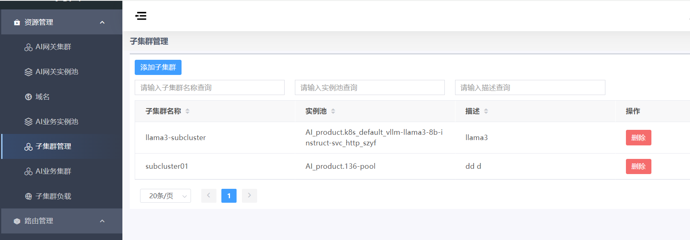
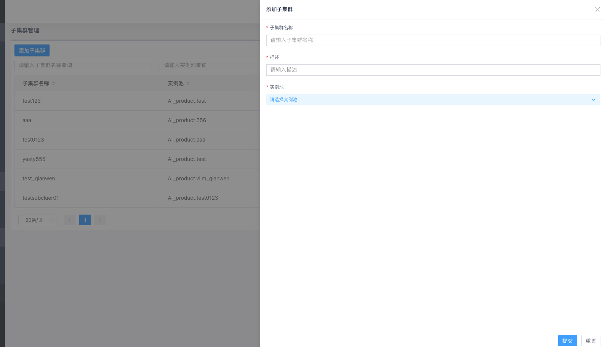

# 子集群管理

## 概述

子集群是集群的组成单元，通常将同一IDC中的后端实例组织为一个子集群。每个子集群关联一个实例池，实例池中包含具体的后端服务实例。

- 进入"资源管理"->"子集群管理"页，点击"添加子集群"
- 输入子集群名称、描述，并为子集群选择关联一个实例池。

## 创建子集群

### 创建步骤

1. 进入"资源管理"->"子集群管理"页面
2. 点击"添加子集群"按钮
3. 填写子集群信息：
   - **子集群名称**：标识子集群的名称，AI_product产品线内必须唯一
     - 命名规则：仅允许字母、数字、连字符、下划线、点，长度大于1
   - **描述**：子集群的描述信息，至少2个字符
   - **关联实例池**：从下拉框选择一个已创建的AI业务实例池

1. 点击"提交"完成创建

## 子集群负载配置

子集群创建完成后，若需要配置子集群之间的流量分配比例，请参考[子集群负载](./sub-cluster-load.md)文档进行详细配置。
