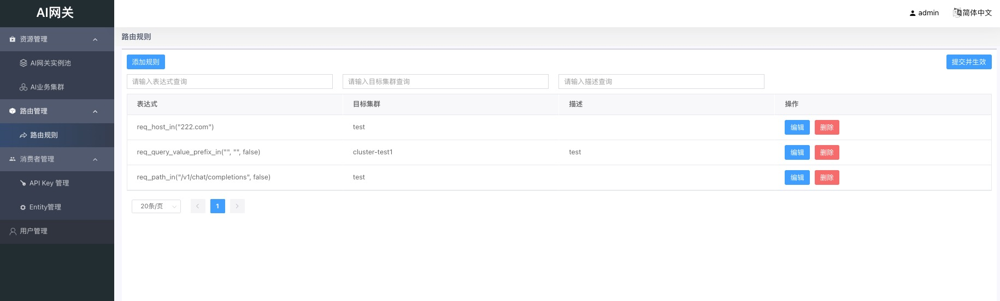
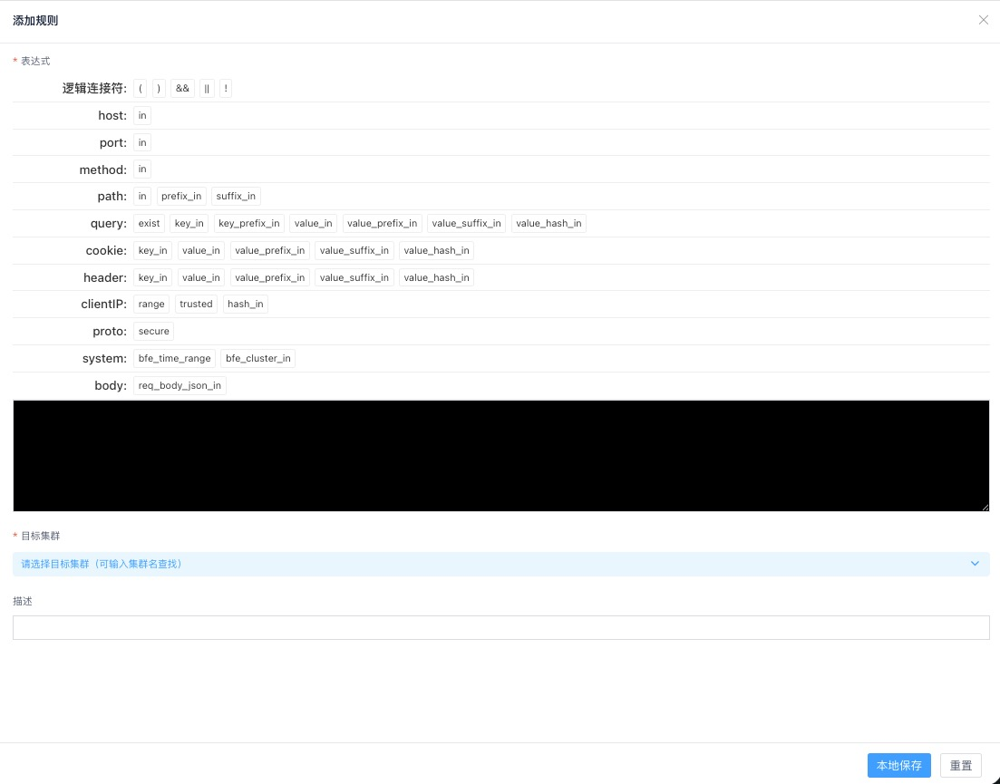

# 路由规则

## 路由规则概述

### 概念和原理

对于AI网关的流量，可能需要由不同的AI业务集群来服务。

对于某个请求，在根据域名确定了请求属于AI_product产品线后，由配置的路由规则来决定请求转发到哪个集群。

每条路由规则包含匹配条件和目标集群，即满足匹配条件的请求转发到该目标集群。

### 路由规则配置

- 在左侧菜单，进入"路由管理"->"路由规则"页。

- 点击"添加路由规则"，进入规则配置页面

添加路由规则时，可以配置以下内容：

- **规则名称**：标识该路由规则的名称，必填且在AI_product产品线内唯一
- **域名**：匹配请求的域名，选填
- **路径匹配**：匹配请求的URL路径，选填
  - 匹配模式：支持精确匹配、前缀匹配、后缀匹配
  - 路径：要匹配的路径
  - 忽略大小写：是否忽略大小写进行匹配
- **请求方法**：匹配HTTP请求方法，选填（支持GET、POST、PUT、DELETE、PATCH、OPTIONS）
- **Header匹配**：匹配HTTP请求Header，选填
  - 可以添加多个Header匹配条件
  - 每个Header需要配置：Header键、Header值、匹配模式、是否忽略大小写
- **模型匹配**：匹配请求中使用的模型，选填
  - Json路径：提取模型名称的Json路径
  - 模型名称：要匹配的模型名称
  - 忽略大小写：是否忽略大小写进行匹配
- **动作**：转发到目标集群，必填（目前仅支持"转发"动作）
  - 目标集群：选择要转发到的AI业务集群

**注意**：至少需要配置一个匹配条件（域名、路径匹配、请求方法、Header匹配、模型匹配其中任一）

### 配置流程

路由规则配置分为两步：

1. 配置路由规则：设置匹配条件和动作
2. 复查确认：查看配置内容

### 提交并生效

配置完成后，在路由规则列表页点击"提交并生效"，使配置生效。
