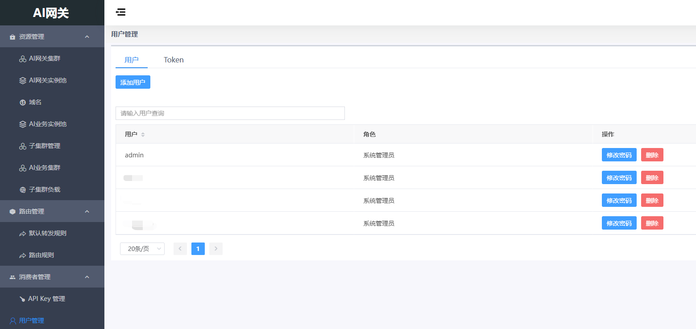
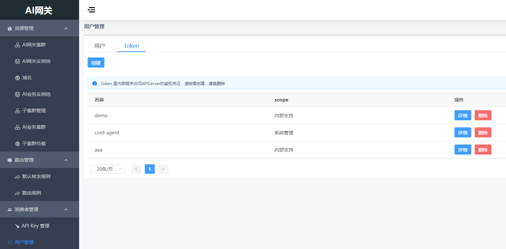

# 用户管理

## 用户管理概述

用户管理模块提供对系统用户和访问Token的管理功能。

## 用户

在左侧菜单，进入"用户管理"->"用户"页，可以管理系统用户。

- 创建用户
- 修改用户密码
- 删除用户

## Token

Token是内部程序访问API Server的鉴权凭证。

在左侧菜单，进入"用户管理"->"Token"页，可以管理访问Token。

- 创建Token
- 删除Token

注意：Token是内部程序访问API Server的鉴权凭证，请按需创建，谨慎删除。
